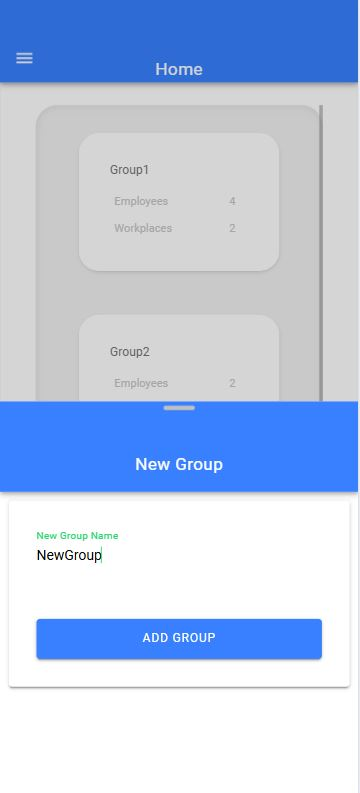
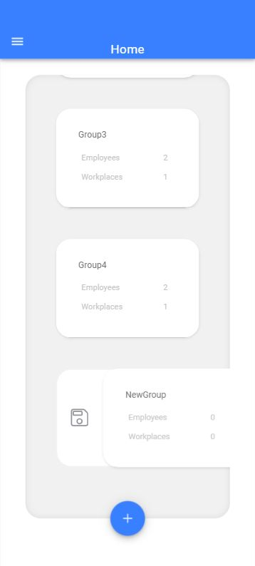
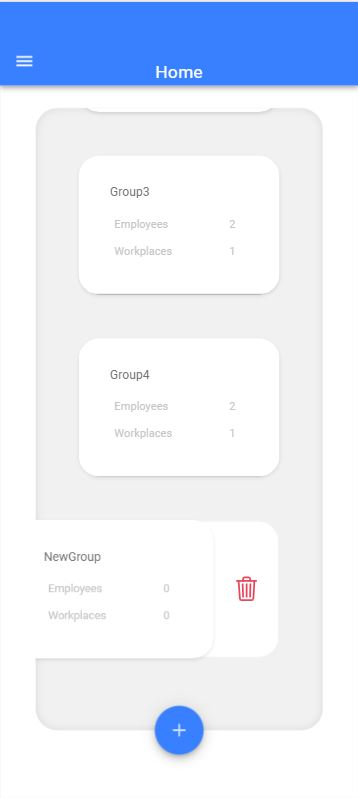
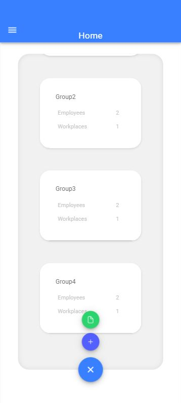
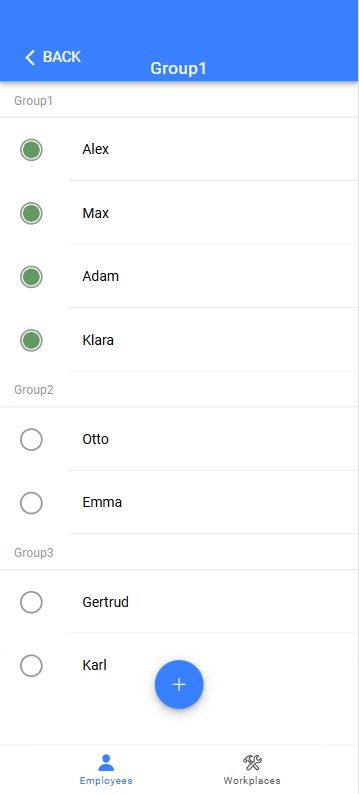
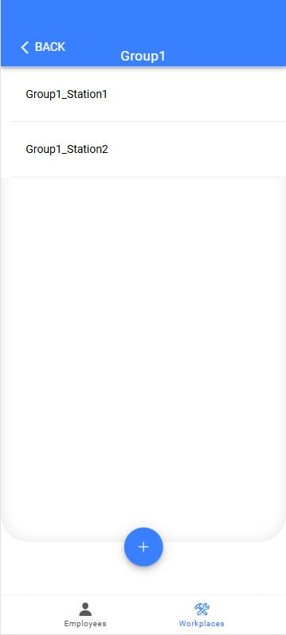
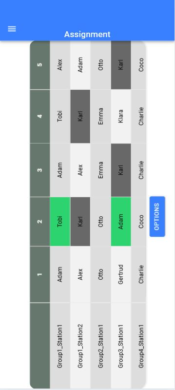
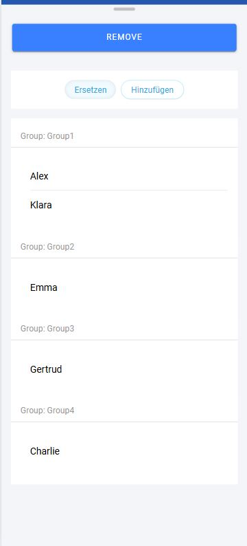
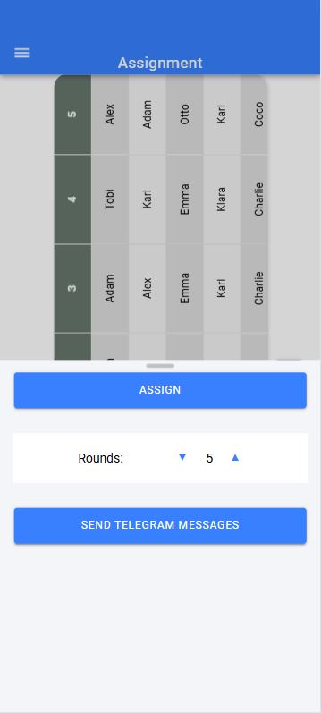

# Workforce Assignment App

An intuitive workforce management application designed to assign employees to workstations in an assembly line setting. The app ensures that no station is left unattended while providing flexibility to adapt to real-time changes.

---

## 🚀 Features

### 🧑‍🔧 Group and Station Management
- **Group Creation**:  
  Users can create groups and assign employees and stations to each group.  
- **Skill Management**:  
  Define which stations each employee can operate – within and across groups.  

### ⚙️ Assignment Automation
- **Automatic Assignments**:  
  Employees are automatically assigned to stations based on availability and skills.  
- **Selective Group Assignments**:  
  Choose which groups should be included in the assignment process.  

### 📅 Employee Availability
- **Toggle Availability**:  
  Mark employees as available or unavailable with a simple toggle.  

### 🔄 Shift Round Management
- **Swap Employees**:  
  Swap employees within a round if both can operate each other's stations.  
- **Add Unassigned Employees**:  
  Easily assign unassigned or even unavailable employees using a modal.  

### 📲 Telegram Messaging Integration
- **Automatic Telegram Notifications**:  
  After assigning employees, the app can automatically send each one a personalized Telegram message showing where they are scheduled to work.  
  This helps improve communication and ensures everyone is informed instantly.

### 🖥️ Intuitive Interface
- **Interactive Assignment Table**:  
  Real-time adjustments and a clear overview of all shifts and stations.  
- **Clean and Responsive Design**:  
  The UI adapts to mobile and desktop environments.

---

## 💡 Use Case

This app is ideal for organizations that:
- Manage rotating staff across multiple workstations (e.g. automotive production lines)
- Need a fast way to react to daily staffing changes
- Want to improve transparency and communication with their workforce

---

## ⚙️ Tech Stack

- **Ionic Framework**: For building a native-like app that runs on Android, iOS, and the Web  
- **Angular**: The core frontend framework used for structure and components  
- **TypeScript**: Strongly typed JavaScript that powers the app logic  
- **Capacitor**: Used to package the web app into native mobile apps  
- **Firebase Hosting**: For web deployment  
- **Telegram Bot API**: For sending automatic employee notifications  

---

## 🌍 Try it out

> 🔗 [Open the App in Your Browser](https://workforceassignment.firebaseapp.com)

---

## 🖼️ Screenshots

| Screenshot | Description |
|-----------|-------------|
|  | **Group Overview** – The home screen displays all created groups in a clear list. Each group can be opened, saved, or deleted. |
|  | **Create Group** – A modal allows you to create a new group where employees and stations can be managed. |
|  | **Save Group** – Swiping right on a group card reveals a save button. The group can be exported as a JSON file. |
|  | **Delete Group** – Swiping left shows a red trash icon to delete the group. |
|  | **Floating Action Button** – Clicking the round button at the bottom right opens options to create a new group or import one from a JSON file. |
|  | **Employee List** – Displays all employees in the group, plus external ones qualified to work in at least one of the group’s stations. Employees are grouped by their original group and can be deleted by swiping. |
|  | **Station List** – Overview of all stations in a group. Stations can be added, edited, or deleted. |
|  | **Assignment Table** – Shows which employee is assigned to which station. Tapping an employee highlights all their assignments and indicates potential swap partners. Swaps are done by simply tapping. |
|  | **Replace Employee** – Double-clicking an employee opens a modal showing available, unassigned employees who can replace the current one at that station. |
|  | **Options for Assignment and Telegram Messages** – Start a new automatic assignment or send Telegram messages to inform each employee about their station. |
|  | **Live Preview** – An animated demonstration of how the app works, showing typical workflows and interactions. |

---

## 🧑‍💻 Author

Built with ❤️ by Me for use by colleagues at the assembly line at Mercedes-Benz.

